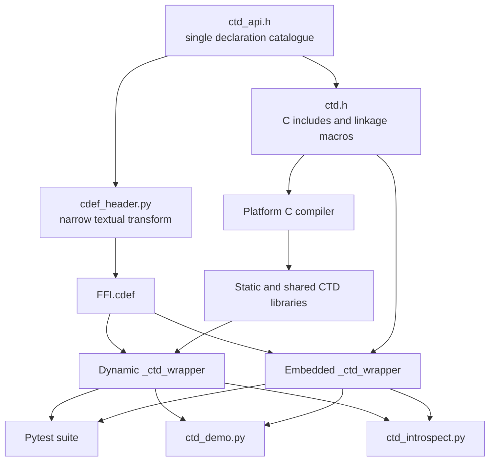

---
urls:
  - https://chatgpt.com/c/6a75f2ad-1b78-83ed-a53d-56ed97b744d9
  - https://chatgpt.com/c/6a74ce73-3018-83eb-a0d1-d1f910585250
---

## 📗 Project Review

> [!NOTE] Prompt - Deep Research + GitHub Plugin
> 
> @Deep research
> I need pchemguy/CFFI_Pytest_C_Testing project assessment from two points:  
> 1. coding agent with no prior context.  
> 2. a human trying to quickly figure out if the project is relevant at all and if can be practically useful (assess if a savvy technical user can intuitively, quickly figure out practical relevance and usefulness of the repo for their specific needs).

### Project Assessment: CFFI_Pytest_C_Testing

#### Executive Summary

At the assessed `main` revision, commit [`e6b5c42`](https://github.com/pchemguy/CFFI_Pytest_C_Testing/commit/e6b5c42de617386fca2fd4afde5d78f187bee37c), this repository is an ambitious **reference and experimentation project for testing deterministic C APIs directly from Pytest through CFFI API mode**, with unusually strong treatment of pointer direction, ownership, lifetime, capacity, callbacks, opaque handles, and dynamic-versus-embedded wrapper builds. A context-free coding agent is given excellent conceptual orientation through [`AGENTS.md`](https://github.com/pchemguy/CFFI_Pytest_C_Testing/blob/e6b5c42de617386fca2fd4afde5d78f187bee37c/AGENTS.md), a highly detailed [`README.md`](https://github.com/pchemguy/CFFI_Pytest_C_Testing/blob/e6b5c42de617386fca2fd4afde5d78f187bee37c/README.md), explicit build scripts, and a broad contract-focused test suite. However, reproducibility is materially weakened by unpinned dependencies, no declared Python-version range, no CI workflow, no test-result badge or recorded baseline, duplicated wrapper builders, and a current apparent **C99 compile blocker** in `ctd_globals_reset()`. A savvy technical user can determine the intended relevance quickly from the README’s objective, supported interface catalogue, and non-goals, but must look beyond the polished documentation before deciding to rely on the project: the repository is versioned `0.0.0`, describes itself as experimental, includes an undocumented legacy-looking `pigen/` subtree, and lacks current automated evidence that either build mode works on supported platforms. The strongest practical role is therefore **a design and test-pattern reference**, not yet a turnkey or CI-proven reusable package.   

**Overall assessment**

| Perspective | Assessment |
|---|---|
| Automated coding agent | **Well explained, but not currently reproducible without diagnosis and likely source correction.** |
| Savvy technical user performing rapid relevance triage | **Purpose and limits are easy to identify; operational maturity and proven usefulness are not.** |
| Best fit | Reference implementation, learning material, test-design catalogue, and experimental CFFI/Pytest fixture. |
| Poor fit without further work | Production dependency, published binding package, turnkey cross-platform template, or evidence-backed build recipe. |
| Current risk | **Medium-high**, primarily because the native build appears blocked and no CI validates the documented matrix. |

#### Scope and Repository Anatomy

The intended core is the `ctd` fixture library. Its architecture deliberately separates a dual-use API declaration catalogue, the C-only linkage header, the deterministic implementation, CFFI declaration transformation, two wrapper modes, demonstrations, introspection, and tests. The root package metadata builds the Python package from `ctd/src/ctd`, while Pytest is configured around `ctd/tests`. The README and `AGENTS.md` describe the source as a compact catalogue of C/Python boundary patterns rather than production library code.   

| Path | Role | Assessment |
|---|---|---|
| [`README.md`](https://github.com/pchemguy/CFFI_Pytest_C_Testing/blob/e6b5c42de617386fca2fd4afde5d78f187bee37c/README.md) | Project objective, contracts, build matrix, examples, non-goals | Exceptionally detailed; too long for a quick-start document |
| [`AGENTS.md`](https://github.com/pchemguy/CFFI_Pytest_C_Testing/blob/e6b5c42de617386fca2fd4afde5d78f187bee37c/AGENTS.md) | Coding-agent orientation and change rules | Strong agent-specific documentation; prescriptive and useful |
| [`pyproject.toml`](https://github.com/pchemguy/CFFI_Pytest_C_Testing/blob/e6b5c42de617386fca2fd4afde5d78f187bee37c/pyproject.toml) | Packaging, dependencies, Ruff, Mypy, root Pytest configuration | Centralized, but dependencies are unpinned and Python support is unspecified |
| [`ctd/src/ctd/ctd_api.h`](https://github.com/pchemguy/CFFI_Pytest_C_Testing/blob/e6b5c42de617386fca2fd4afde5d78f187bee37c/ctd/src/ctd/ctd_api.h) | Authoritative C/CFFI declaration catalogue | Repository’s strongest technical artifact |
| [`ctd/src/ctd/ctd.h`](https://github.com/pchemguy/CFFI_Pytest_C_Testing/blob/e6b5c42de617386fca2fd4afde5d78f187bee37c/ctd/src/ctd/ctd.h) | C includes, linkage/export policy, C++ guards | Clear but contains a likely static-build macro mismatch with `ctd_api.h` |
| [`ctd/src/ctd/ctd.c`](https://github.com/pchemguy/CFFI_Pytest_C_Testing/blob/e6b5c42de617386fca2fd4afde5d78f187bee37c/ctd/src/ctd/ctd.c) | Deterministic C implementation | Readable and modular; current revision appears not to compile as C99 |
| [`ctd/src/ctd/cdef_header.py`](https://github.com/pchemguy/CFFI_Pytest_C_Testing/blob/e6b5c42de617386fca2fd4afde5d78f187bee37c/ctd/src/ctd/cdef_header.py) | Narrow header-to-CDEF transformer | Small and understandable, intentionally brittle |
| [`build_ctd.py`](https://github.com/pchemguy/CFFI_Pytest_C_Testing/blob/e6b5c42de617386fca2fd4afde5d78f187bee37c/ctd/src/ctd/build_ctd.py) | Static and shared native CTD builds | Explicit stages and useful diagnostics; relies on private `setuptools._distutils` APIs |
| [`build_ctd_wrapper.py`](https://github.com/pchemguy/CFFI_Pytest_C_Testing/blob/e6b5c42de617386fca2fd4afde5d78f187bee37c/ctd/src/ctd/build_ctd_wrapper.py) | Dynamically linked CFFI wrapper | Portable intent, explicit runtime search path handling |
| [`build_ctd_wrapper_embedded.py`](https://github.com/pchemguy/CFFI_Pytest_C_Testing/blob/e6b5c42de617386fca2fd4afde5d78f187bee37c/ctd/src/ctd/build_ctd_wrapper_embedded.py) | Embedded-source CFFI wrapper | Nearly duplicates dynamic builder, creating drift risk |
| [`ctd/tests`](https://github.com/pchemguy/CFFI_Pytest_C_Testing/tree/e6b5c42de617386fca2fd4afde5d78f187bee37c/ctd/tests) | Contract and CFFI-usage tests | Broad and pedagogically strong, but assumes a wrapper was already built |
| [`docs`](https://github.com/pchemguy/CFFI_Pytest_C_Testing/tree/e6b5c42de617386fca2fd4afde5d78f187bee37c/docs) | Exploratory background notes | Rich background, but not organized as a conventional maintained documentation site |
| [`pigen`](https://github.com/pchemguy/CFFI_Pytest_C_Testing/tree/e6b5c42de617386fca2fd4afde5d78f187bee37c/pigen) | Separate older-looking CFFI example | Not represented in the documented core layout and likely to distract an unfamiliar reader |
| [`pyenv`](https://github.com/pchemguy/CFFI_Pytest_C_Testing/tree/e6b5c42de617386fca2fd4afde5d78f187bee37c/pyenv) | Local environment-management material | Explicitly out of scope for agents, but still adds repository-level ambiguity |

The undocumented `pigen/` subtree is particularly important for discoverability. It contains another C source/header set, Python builders, a batch file, and demos, but the current README’s repository layout focuses exclusively on CTD. Its older builder uses relative working-directory paths, commented-out source compilation, a `Sequence` import from `typing`, and a different macro model. A no-context agent that searches the whole repository could reasonably mistake it for active code or attempt to modernize it as part of the main project.     

The intended dependency and build flow is coherent:



This architecture avoids a separately handwritten CDEF file, lets the actual compiler validate structure layouts and declarations, and applies one Python-facing import interface to two native integration modes. That is a strong design for the project’s educational objective. The trade-off is that `ctd_api.h` must remain within the limited subset understood by the regex transformer; conditional alternatives, `#else`, `#elif`, macro-generated declarations, or general preprocessing would break the model.   

#### Build, Dependencies, and Execution Evidence

The documented Linux setup is `python -m pip install -e ".[dev]"`, followed by explicit static checks and a sequential two-mode native validation matrix. The dynamic path requires building the standalone CTD library, then the dynamic wrapper, then running the demo, tests, and introspection. The embedded path overwrites the common `_ctd_wrapper` module and must be tested in fresh Python processes. The README correctly warns that native extension replacement is a sequential build concern, not a normal Pytest parameter. 

The Python metadata declares `cffi` and `setuptools` as runtime dependencies, and groups Pytest, coverage, Ruff, Mypy, Hatch, and `uv` under optional extras. It does **not** declare `requires-python`, upper or lower package constraints, a lock file, compiler requirements, supported compiler versions, or platform-specific constraints. `hatchling` is the build backend, while native compilation directly imports `setuptools._distutils`, an implementation detail rather than a stable public setuptools API. These choices make the environment flexible but reduce long-term reproducibility.  

The tracked Conda file is not authoritative for cloud or general setup and does not match the root development dependency set: it includes `pyyaml`, `pyinstrument`, Pytest-related packages, and CFFI, but omits Ruff, Mypy, `types-cffi`, Hatch, and `uv`. The documentation explicitly instructs Windows agents not to execute or modify `pyenv/`, which helps avoid one class of mistake but confirms that repository-local environment material is user-specific infrastructure rather than a reproducible cross-platform environment definition.  

**Execution performed during this assessment**

| Command or action | Result | Interpretation |
|---|---|---|
| `git clone --depth 50 https://github.com/pchemguy/CFFI_Pytest_C_Testing.git` | **Not completed**: sandbox DNS could not resolve `github.com` | This is an assessment-environment limitation, not evidence of a repository defect |
| Full `pip install`, native build, demo, Pytest, Ruff, Mypy, coverage | **Not performed** because a working tree could not be cloned into the execution container | No full-suite pass or failure is claimed |
| Repository access and file inspection through the GitHub connector | **Performed** at commit `e6b5c42...` | Primary-source static analysis was possible |
| Latest commit CI-status inspection | No status checks were attached | There is no externally visible CI result to substitute for local execution |
| C99 syntax probe reproducing the exact `ctd_global_cur_point = {0.0, 0.0};` statement | **Failed** with `error: expected expression before '{' token` | Strong evidence that the checked-in C implementation does not compile as documented |
| Corrected probe using `ctd_global_cur_point = (ctd_point){0.0, 0.0};` | **Passed** under `cc -std=c99 -Wall -Wextra -Wpedantic -fsyntax-only` | Confirms the likely minimal C99 correction |

The offending checked-in function is:

```c
CTD_API void ctd_globals_reset(void) {
    ctd_global_counter = 0;
    ctd_global_last_status = CTD_OK;
    ctd_global_scale = 1.0;
    ctd_global_cur_point = {0.0, 0.0};
}
```

A braced initializer is valid in a declaration, but not as an ordinary assignment expression in C99. A compound literal is required:

```c
ctd_global_cur_point = (ctd_point){0.0, 0.0};
```

Because both the standalone and embedded builds compile `ctd.c`, this appears to block **both** documented wrapper paths before Pytest can run. The current tests call `ctd_globals_reset()`, but no test can compensate for a translation-unit compile failure.  

A second likely build-model defect is the inconsistent macro name around constant-data declarations. `build_ctd.py` defines `CTD_STATIC_LIB`, and `ctd.h` recognizes `CTD_STATIC_LIB`; however, `ctd_api.h` conditionally exposes several const globals under `CTD_C_API || CTD_BUILD_STATIC_LIB`. Since `CTD_BUILD_STATIC_LIB` is not the macro used by the builder, a static-library consumer using the documented static mode may not receive declarations for `ctd_max_supported_point_count`, `ctd_numeric_epsilon`, `ctd_library_name`, or `ctd_origin_point`. Dynamic and embedded CFFI builds define `CTD_C_API`, so they may not reveal this inconsistency.  

The setup instructions are therefore **procedurally clear but not currently demonstrated to be reproducible**. The distinction matters: the README gives exact commands and explains why each is needed, but successful execution depends on fixing or reconciling source-level issues, having a compatible C compiler and Python development headers, and avoiding stale `_ctd_wrapper` artifacts from the other build mode. 

#### Code, Tests, CI, and Security

**Code quality.** The declaration header is unusually rigorous. It documents direction, shape, nullability, retention, ownership, size units, output preservation, release functions, and borrowed aliases adjacent to the declarations. This gives both humans and agents a much stronger basis for deriving tests than conventional comments such as “input pointer” or “returns buffer.” The implementation is mostly flat, deterministic, and easy to trace, with limited abstraction and explicit overflow, allocation, and capacity checks.    

The Python side is similarly readable. Builders have a single `main()` entry point, use `Path`, and keep compile and link decisions explicit. Tests are divided by contract family rather than accumulated in one module. The test code uses meaningful parameter IDs, output sentinels, `try/finally` cleanup, and fixtures for owned resources. These are good examples for agents learning how to handle CFFI ownership safely.   

The main code-quality reservations are operational rather than stylistic:

- The checked-in C99 assignment defect is a release-blocking correctness problem. 
- The static-build macro mismatch indicates that the linkage matrix is not being mechanically validated across all declared modes. 
- The dynamic and embedded builders duplicate most of their code; their platform handling has already diverged because the dynamic builder has macOS/Linux rpath logic while the embedded builder does not need or share a common configuration layer. Future changes to declarations, compiler flags, macros, or output paths must be applied twice.  
- `cdef_header.py` deliberately deletes selected preprocessor lines without evaluating them. This is appropriate for the constrained fixture, but a contributor can silently invalidate the CDEF stream by introducing otherwise ordinary preprocessor structures. The transformer is tested for representative declarations, not as a general equivalence checker between compiler-visible and CFFI-visible APIs.  
- `build_ctd.py` begins with a bare ChatGPT conversation URL as its module docstring. It is not an executable secret, but it is not durable technical provenance and may point to inaccessible private context. 

**Test coverage and reliability.** By source inspection, the suite contains roughly ninety parameter-expanded behavioral cases across globals, enums, exact scalar behavior, failure preservation, arrays, byte buffers, strings, structures, unions, recursive CFFI data, callbacks, function pointers, borrowed memory, owned memory, and opaque handles. The emphasis is better described as **contract breadth** than measured source coverage. No generated coverage report, required percentage, branch threshold, or current successful collection output is present in the inspected configuration.     

The test design itself is strong. Examples include proving outputs remain unchanged on failure, checking exact and insufficient capacities, verifying embedded NUL bytes as ordinary buffer data, directly borrowing Python `bytearray` storage with `ffi.from_buffer()`, and releasing different C-owned object types with their exact release functions. The fixtures reset mutable global state and clean up allocated resources.    

Reliability is nevertheless limited by the execution model. `wrapper_module()` simply imports `_ctd_wrapper`; it does not build it or verify that it corresponds to the intended dynamic or embedded mode. The same module name is overwritten by both builders, so a stale binary, loaded module, or incompatible artifact can produce misleading results. The suite also lacks sanitizer runs, allocator diagnostics, native ABI/export checks in CI, or a matrix proving Python/compiler/OS compatibility.  

**CI configuration.** Repository API inspection found no `.github/workflows` directory at the assessed commit; code search found no `actions/checkout` usage, and the latest commit had no attached status checks. Consequently, the nine-step documented matrix is a manual specification rather than an automated gate. There is no current evidence that Windows/MSVC, Linux/GCC or Clang, macOS, multiple Python versions, dynamic linkage, embedded compilation, Ruff, Mypy, and Pytest are all passing together.

A minimal CI strategy should run at least Linux and Windows, build and test dynamic and embedded modes in separate jobs or isolated workspaces, run Ruff and Mypy, upload build logs on failure, and add a dedicated static-library consumer compile test. The static consumer is needed because the probable `CTD_STATIC_LIB` versus `CTD_BUILD_STATIC_LIB` defect is not exercised by the Python wrapper paths.

**Security and sensitive material.** No obvious API keys, cloud credentials, private keys, passwords, `.env` contents, or committed runtime secrets were found in the primary files and targeted code searches. The `.gitignore` covers `.env`, `.envrc`, `.pypirc`, Streamlit secrets, virtual environments, native binaries, coverage outputs, generated databases, and common editor files. This is a good baseline, but it does not prove that Git history is clean; a proper assessment should still scan all reachable commits with a secret-scanning tool. 

The more material security risks are supply-chain and native-code risks: dependencies are unpinned, there is no dependency-update policy, the build invokes the local compiler and linker, native allocations and callbacks cross a language boundary, and no CI sanitizer job is present. The C functions are intentionally small and mostly defensive, but this repository should not be treated as memory-safety validated merely because the Python tests cover ownership contracts.  

**Licensing and contribution process.** The repository has a clear MIT license dated 2026, permitting use, modification, distribution, sublicensing, and sale subject to preservation of the notice. No `CONTRIBUTING.md`, `SECURITY.md`, or conventional contributor-facing workflow file was found. `AGENTS.md` contains detailed change discipline, testing rules, formatting conventions, and architecture constraints, but it is optimized for coding agents and does not replace a concise human contribution guide describing issue expectations, branch policy, supported environments, review requirements, or release practice.  

#### Automated Coding Agent Perspective

**Discoverability: high conceptually, medium structurally.** An agent that reads `AGENTS.md` first will learn the project’s objective, supported environments, core files, build modes, architecture invariants, C style, ownership model, test intent, generated-artifact policy, and validation sequence. This is substantially better than the typical repository. The risk is that the documented inventory is explicitly non-exhaustive and omits `pigen/`, so the agent must still inspect the real tree before deciding scope.  

**Reproducibility: medium-low.** The commands are explicit, but no exact Python version, compiler version, dependency lock, container, CI definition, or known-good commit result is supplied. Installation does not itself build the native wrapper, and Pytest assumes the wrapper already exists. At the assessed revision, native compilation is likely to stop at the invalid struct assignment.    

**Required unstated or weakly stated assumptions**

1. A compatible Python interpreter, Python development headers, C compiler, linker, and platform SDK are already available.
2. Current `cffi`, `setuptools`, and `hatchling` releases remain compatible with the project’s use of `setuptools._distutils`.
3. The shell can execute the documented subshell syntax on Linux; Windows users must translate commands to `cmd.exe`.
4. The generated extension lands in `ctd/src/ctd` and is importable through the test path mutations.
5. A previous wrapper or shared library from another Python version or build mode has not been left behind.
6. `$ORIGIN` or `@loader_path` rpath behavior is accepted by the active linker and runtime loader.
7. The repository’s core scope is CTD and not the undocumented `pigen` subtree.
8. The narrow CDEF transformer’s assumptions remain true for any edited declaration.  

**Likely failure modes**

| Failure mode | Expected symptom | First diagnostic |
|---|---|---|
| Current C99 struct-assignment defect | Compiler rejects `ctd.c` | Inspect `ctd_globals_reset()` |
| Missing compiler or Python headers | Compiler or extension build fails immediately | Check compiler discovery and a trivial Python extension build |
| Dynamic wrapper built before CTD shared library | Linker cannot find `ctd`, or runtime import cannot load `libctd`/`ctd.dll` | Run `build_ctd.py` first and inspect emitted paths |
| Stale wrapper from other mode or interpreter | Import error, symbol mismatch, misleading test result | Remove only generated wrapper artifacts and rebuild |
| Wrong working directory | Tests or imports fail despite built artifacts | Follow root-versus-`ctd/` instructions exactly |
| Static linkage macro mismatch | Native static consumer cannot see const declarations | Compare `CTD_STATIC_LIB` with `CTD_BUILD_STATIC_LIB` |
| Header gains unsupported preprocessing | `FFI.cdef()` parse errors or declarations disappear | Run `test_cdef_header.py` and inspect transformed output |
| Dependency drift | Import or build failure after upgrading setuptools/CFFI | Record versions and reproduce in a clean environment |
| Mutable global leakage | Order-dependent tests | Use or extend `reset_globals` fixture |
| Incorrect ownership change | Leaks, double-free, or invalid memory access | Trace declaration contract, implementation, and cleanup test together |

**Minimal actions to run tests and make a simple change**

1. Check out an exact revision and inspect the complete tree. Read `AGENTS.md`, the README’s environment and matrix sections, `pyproject.toml`, and the relevant declaration, implementation, and test files. Do not assume `pigen/` is part of the requested CTD change. 
2. Create an isolated environment and record the actual versions:
   ```console
   python --version
   python -m pip --version
   python -m pip install -e ".[dev]"
   ```
3. Verify a usable compiler and run the non-native checks first:
   ```console
   cc --version
   python -m ruff check ctd/src/ctd/ctd_demo.py ctd/src/ctd/build_ctd.py ctd/src/ctd/build_ctd_wrapper.py ctd/src/ctd/build_ctd_wrapper_embedded.py ctd/src/ctd/cdef_header.py ctd/tests
   python -m mypy ctd/src/ctd/ctd_demo.py ctd/src/ctd/build_ctd.py ctd/src/ctd/build_ctd_wrapper.py ctd/src/ctd/build_ctd_wrapper_embedded.py ctd/src/ctd/cdef_header.py ctd/tests
   ```
   These are the repository’s documented static-analysis commands. 
4. Correct the immediate compile blocker:
   ```c
   ctd_global_cur_point = (ctd_point){0.0, 0.0};
   ```
   Add assertions to `test_globals_reset_restores_all_defaults()` for `ctd_global_cur_point.x` and `.y`, because the existing reset test verifies the other mutable globals but not the point.  
5. Collect tests before building:
   ```console
   python -m pytest --collect-only
   ```
   Treat collection as structural validation only; runtime tests still require `_ctd_wrapper`. 
6. Run the dynamic path in separate processes:
   ```console
   python ctd/src/ctd/build_ctd.py
   python ctd/src/ctd/build_ctd_wrapper.py
   python ctd/src/ctd/ctd_demo.py
   (cd ctd && python -m pytest)
   python ctd/src/ctd/ctd_introspect.py
   ```
7. Replace the wrapper with the embedded build and rerun consumers in fresh processes:
   ```console
   python ctd/src/ctd/build_ctd_wrapper_embedded.py
   python ctd/src/ctd/ctd_demo.py
   (cd ctd && python -m pytest)
   python ctd/src/ctd/ctd_introspect.py
   ```
8. For a change touching linkage or global declarations, additionally compile a small external C consumer against the static archive. The documented Python matrix does not currently prove that the `CTD_STATIC_LIB` declaration mode is internally consistent.
9. Review the diff for generated outputs and remove them before commit. Generated wrapper sources, binaries, archives, object files, build trees, and `cffi_model.db` are explicitly non-authoritative. 

#### Savvy Technical User Perspective

A savvy technical user can determine **conceptual fit** quickly: the opening README states that the repository demonstrates direct Pytest testing of deterministic C APIs through CFFI API mode, and the early catalogue shows exactly which boundary patterns are represented. The non-goals clearly exclude general binding generation, arbitrary C parsing, retained callbacks, asynchronous use of Python-owned pointers, allocator interchange, and competing binding technologies. That makes “is this relevant to my interface shape?” easy to answer. What is not quickly provable is whether the repository is operationally useful on the user’s own toolchain: build evidence is manual, CI is absent, Python/compiler support is unspecified, the current C source appears uncompilable, and the package version remains `0.0.0`. The user can therefore assess **subject-matter relevance in minutes**, but must perform a local build before treating the examples as a dependable working baseline.   

**Rapid relevance checklist**

- **Strong positive signal:** the need involves CFFI API mode rather than `ctypes`, ABI-mode `dlopen()`, SWIG, pybind11, or a generated binding framework. 
- **Strong positive signal:** the API has pointers, caller-provided buffers, exact capacity protocols, borrowed versus owned returns, structs, unions, callbacks, function pointers, or opaque handles.  
- **Strong positive signal:** the user wants examples that pair declaration contracts directly with Pytest assertions and cleanup behavior.  
- **Caution signal:** the user needs a production-ready package, stable semantic versioning, published wheels, supported-version policy, changelog, or release process. The current metadata says `0.0.0` and provides none of those assurances. 
- **Caution signal:** the user needs evidence that Windows, Linux, and macOS all pass now. The README describes portability, but no CI proves it.
- **Negative signal:** the application requires retained callbacks, asynchronous access to Python-owned memory, arbitrary graph marshalling, or a general C preprocessor/parser; these are explicit non-goals. 
- **Immediate due-diligence signal:** inspect `ctd.c` and run the first native build before investing further, because the assessed head contains an apparent compile blocker. 
- **Scope-clarity signal:** decide whether `pigen/` is historical, experimental, or supported; the primary documentation does not explain it.  

The fastest useful reading path is: README objective and non-goals; `ctd_api.h` comments for a comparable pointer or ownership pattern; one matching test module; then the appropriate wrapper builder. Reading the entire README or exploratory `docs/` tree is unnecessary for initial relevance triage.  

#### Comparative Assessment and Recommended Next Steps

| Attribute | Automated agent with no prior context | Savvy technical user assessing fit |
|---|---|---|
| Ease of setup | **Medium-low.** Exact commands exist, but native prerequisites are assumed, installation does not build the wrapper, and current C appears not to compile. | **Medium.** The required stack is obvious, but a local proof build is mandatory before relying on it. |
| Documentation clarity | **High.** `AGENTS.md` supplies architecture and change discipline specifically for agents. | **Medium-high.** Scope and non-goals are clear, but the README is much longer than needed for rapid triage. |
| Discoverability | **Medium-high.** Core CTD files are mapped well; actual tree inspection is still required because `pigen/` is omitted. | **Medium-high.** Subject relevance is visible quickly; repository maturity signals require more investigation. |
| Build reproducibility | **Low to medium.** Unpinned dependencies, no Python range, no lock, no CI, private distutils API, and a compile defect. | **Low until locally verified.** Documentation is not equivalent to a passing target-platform build. |
| Test reliability | **Medium in design, low in verified status.** Strong cases and fixtures, but no current execution result and no automated wrapper construction. | **Medium as reference evidence.** Tests communicate intended behavior well, but do not establish current portability. |
| Modification difficulty | **Medium.** Declaration, implementation, builder, and tests must remain synchronized across two wrapper modes. | **Medium.** Individual examples are easy to adapt, while preserving the full linkage matrix is more demanding. |
| Security risk | **Low for exposed secrets; medium for native and supply-chain risk.** No obvious credentials, but dependencies and native memory behavior are not continuously scanned. | **Medium.** Suitable for study, but adoption requires dependency review, compiler hardening, and sanitizer testing. |
| Maintenance risk | **Medium-high.** Rapidly evolving experimental code, duplicated builders, manual matrix, legacy-looking subtree, and no CI gate. | **Medium-high if adopted directly; low if used only as a pattern catalogue.** |
| Overall usefulness signal | Strong as an agent-readable reference after fixing the build and validating both modes. | Strong for deciding whether the represented CFFI patterns match the user’s needs; weak as proof of production readiness. |

**Recommended next steps for the repository from the agent perspective**

1. Fix the C99 assignment and add direct reset assertions for the point global.
2. Reconcile `CTD_STATIC_LIB` and `CTD_BUILD_STATIC_LIB`, then add a static external-consumer compile test.
3. Refactor the dynamic and embedded builders around one shared configuration function, leaving only mode-specific sources, libraries, macros, and rpath behavior.
4. Add CI with Linux and Windows as the minimum supported matrix; add macOS if it is intended to be supported rather than merely handled conditionally.
5. Run dynamic and embedded builds in isolated jobs, not by overwriting the same wrapper in one workspace without cleanup.
6. Add compiler hardening and diagnostics: warnings-as-errors for the fixture, AddressSanitizer and UndefinedBehaviorSanitizer on a supported Linux job, and an export-table check for diagnostic builds.
7. Declare a Python support range and add a reproducible development lock or constraints strategy.
8. Mark `pigen/` as historical, document its role, move it under an `examples/legacy/` path, or remove it if it is no longer maintained.
9. Add `CONTRIBUTING.md`, `SECURITY.md`, a short changelog, and a concise quick-start near the top of the README.
10. Replace the private ChatGPT conversation URL in `build_ctd.py` with durable repository documentation or an explanatory module docstring.

**Recommended next steps for the savvy technical user**

First, decide whether the needed interface pattern is actually represented by checking `ctd_api.h` and one corresponding test module. Next, run only the embedded wrapper path as the quickest native proof because it avoids the separate shared-library linkage stage; then run the dynamic path if external shared-library behavior is relevant. Do not judge the repository by documentation alone: require a clean build and passing tests on the intended Python/compiler/OS combination. For direct adoption, additionally require the compile defect and macro inconsistency to be resolved, CI to validate both wrapper modes, dependency versions to be bounded, and native sanitizer runs to pass. For use solely as a test-pattern reference, those maturity gaps are less consequential, and the declaration comments plus ownership-focused tests are already valuable.
